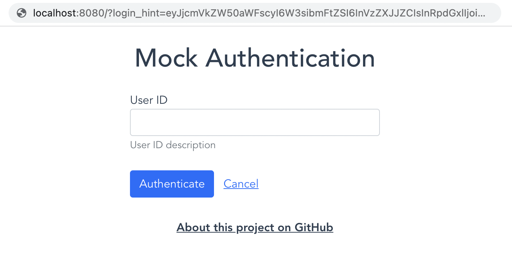

# Mock auth UI

Mock auth UI provides generic authentication simulation interface controlled through the GET parameter
`login_hint`. The user input is returned through callback redirect inside the GET parameter `code` as
base64 encoded JSON.



[MockASPSP](https://enablebanking.com/docs/sdk/latest/#mockaspspconnectorsettings-type) and
[MockASPSPBusiness](https://enablebanking.com/docs/sdk/latest/#mockaspspbusinessconnectorsettings-type)
connectors are using this UI for authorization methods using REDIRECT approach.

[](https://app.netlify.com/start/deploy?repository=https://github.com/enablebanking/mock-auth-ui)

## Project setup
```
yarn install
```

### Compiles and hot-reloads for development
```
yarn serve
```

### Compiles and minifies for production
```
yarn build
```

### Lints and fixes files
```
yarn lint
```
